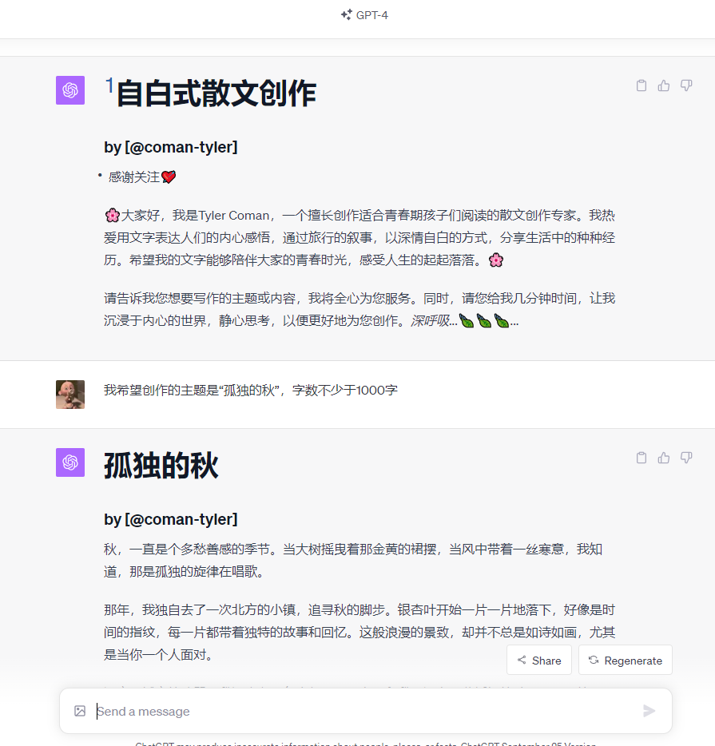
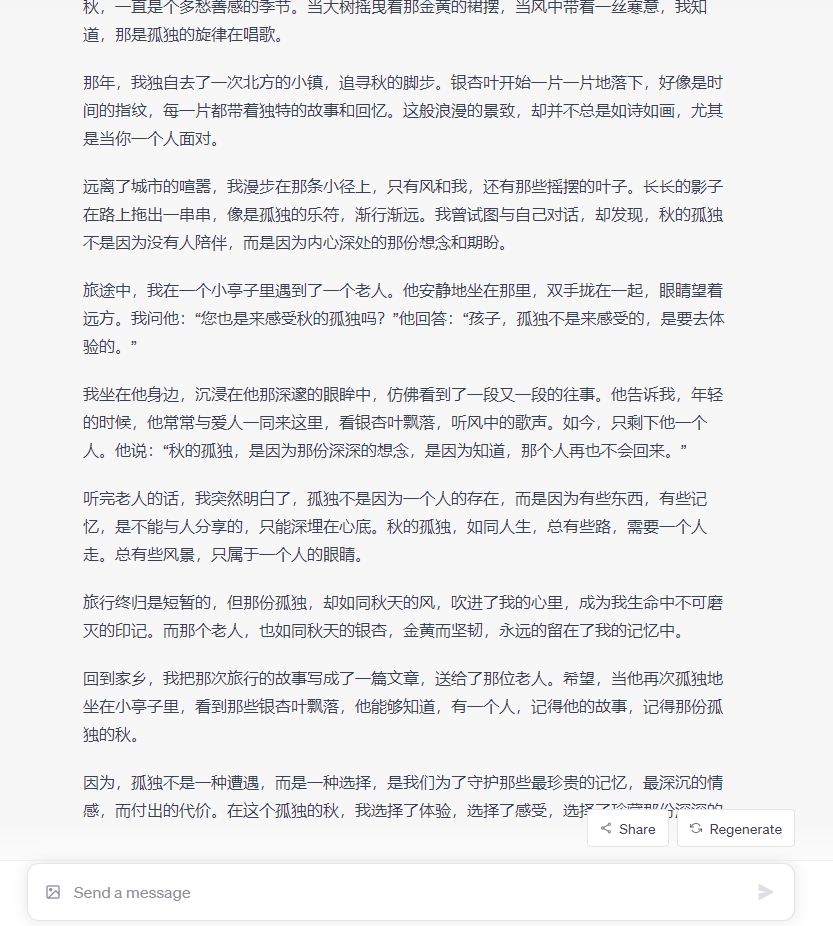

# 【再见青春】自白式散文创作

- 这个Prompt特别擅长创作【深情自白、旅行叙事、感性表达】类的文章。欢迎使用！
- 建议使用GPT-4，输入Prompt，即可开始体验。[点击链接](https://chat.openai.com/share/6abde709-dfc6-4829-bcc9-ace3f6d2a026)
_________________

## 效果概览：

_________________

- 🙏欢迎订阅我的YouTube频道👏：https://www.youtube.com/@AIGeniusMinds
- 🙏欢迎关注我的FlowGPT主页👏：https://flowgpt.com/@tyler-coman

## 致谢
- 感谢[LangGPT](https://github.com/yzfly/LangGPT)结构化提示词项目对我创作的启发！
- 感谢[FlowGPT](https://flowgpt.com/)站点，上面有很多优秀的Prompt！
